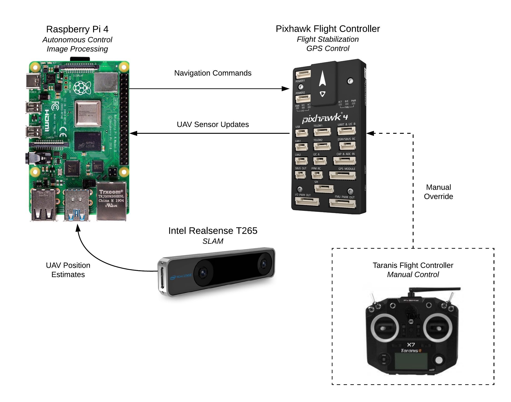

# SLAM 

## Overview 

Simultaneous Localization and Mapping (SLAM) is the problem of constructing a map of an unknown environment while simultaneously navigating a robot through that environment. It's been a heavily researched topic for many years, but still has a long way to go before it can be widely adopted as a universal robotic localization method. For this UAV, VADL tried to implement SLAM because it is a promising solution to the challenge of planetary space exploration. Since there is no GPS on the Moon or Mars, a UAV will have to track its position without any external aid. The rovers currently on Mars are manually controlled and tracked by a few satellites orbiting the planet. This means that the rovers can only crawl along, barely moving throughout their entire life span. A UAV with SLAM could explore new environments and return to previous locations all without manual control.

## Implementation

The team used the [Intel Realsense T265 V-SLAM tracking camera](https://www.intelrealsense.com/tracking-camera-t265/), an off-the-shelf SLAM solution. The T265 is a remarkable product, but it's very new and quite finnicky. If you're having some problems working with this sensor, our own development problems might provide some insight, which are documented [here](../docs/achieving_slam_flight.md). 

Below is an overview of the electronics used for guidance, navigation, and control. 

**Raspberry Pi 4:** The Raspberry Pi 4 is the on-board processor that handles autonomous UAV control. Its primary benefits for software are its large amount of processing power for its small dimensions and its ease of use with the other GNC components. The Raspberry Pi will be running all the image processing algorithms for sample zone detection, air-based sampling, and charging station landing.  

**Pixhawk Flight Controller:** The Pixhawk handles flight stabilization and motor control. The Pi sends navigation commands to the Pixhawk and the Pixhawk sends UAV sensor updates back to the Pi. These sensor updates will be used by the image processing algorithms to update the autonomous navigation commands sent by the Pi.

**Intel Realsense T265:** The Intel Realsense performs V-SLAM localization and sends a UAV position estimate to the Raspberry Pi. The Raspberry Pi will use this position estimate to navigate back to the rocket after the UAV performs air-based sampling. Messages are sent over MAVlink. Refer to [realsense_localization.py](realsense_localization.py) for more details.

**Manual Remote Controller:** The Taranis QX7 flight controller is used to manually fly the UAV. Manual overrides have been programmed into the autonomy code so that the flight operator can always step in autonomous navigation fails.

## Configuring the Pixhawk for SLAM Flight

## UAV Reference Frames